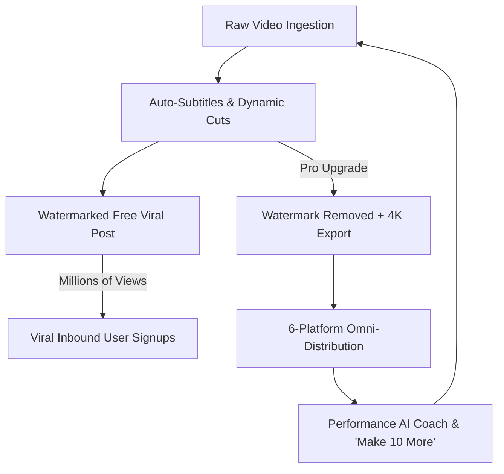

# 🚀 KontentOS — Executive Concept Brochure
### *The All-In-One AI Creator Operating System*
**Tagline:** *Think. Create. Publish. Grow. Earn.*  
**Target:** The 200M+ Everyday Creators, Casual Entertainers & Solopreneurs Worldwide

---

## 🌟 1. The Vision

> **"You just talk to your camera. KontentOS does literally everything else."**

KontentOS transforms anyone with a smartphone into a prolific, viral multi-platform creator. By combining **zero-friction AI ideation**, **automated raw-to-reel video editing**, **dynamic animated subtitles**, and **1-click omni-channel publishing**, creators can produce 30 days of high-converting content in just 30 minutes.

```
                  ┌──────────────────────────────────────────────┐
                  │                 THE OLD WAY                  │
                  │   4-6 Disconnected Apps • 4 Hours / Post     │
                  │   ChatGPT ──> CapCut ──> Submagic ──> Buffer │
                  └──────────────────────┬───────────────────────┘
                                         │
                                         ▼
                  ┌──────────────────────────────────────────────┐
                  │              THE KONTENTOS WAY               │
                  │       1 Single App • 4 Minutes / Post        │
                  │  Idea ──> Raw Video ──> Auto-Sub ──> Publish │
                  └──────────────────────────────────────────────┘
```

---

## ⚡ 2. The Dual-Track Engine

KontentOS is built to capture both the **Mass Entertainment Market** and the **High-Ticket Pro Market**:

### Track 1: ⚡ Mass Viral & Entertainment Mode
* **Built For:** Casual users, students, comics, everyday storytellers, and meme creators.
* **Frictionless Setup:** Zero complex surveys. Pick a vibe (*Relatable Skit, POV Rant, Aesthetic Vlog, Pet Chaos, Hot Take*).
* **Magic Enhancer:** Auto-detects comedic punchlines, adds snap-zooms, sound FX cues, and viral kinetic subtitles with emojis (😂💀🔥).
* **Viral Watermark:** Free exports feature the sleek **"⚡ Made with KontentOS"** badge, driving organic word-of-mouth discovery.

### Track 2: 🎯 Pro & Niche Authority Mode
* **Built For:** Coaches, educators, tech founders, consultants, and agencies.
* **Deep Creator Brain:** Stores audience DNA, signature hook formulas, brand guidelines, and tone rules.
* **Opportunity Radar:** Scores daily trends on a 0–100 scale based on audience interest and competition.
* **Omni-Asset Repurposer:** Converts 1 video into 6 platform-tailored formats (LinkedIn essays, X threads, YouTube Shorts, etc.).

---

## 📱 3. The 6-Platform Omni-Channel Publisher

Publish simultaneously to all major social ecosystems from a single screen:

| Platform | Format Handled Automatically |
| :--- | :--- |
| **📸 Instagram** | 9:16 Reels + Stories + Visual storytelling caption with hashtag stack |
| **▶️ YouTube** | Shorts + Long-form video with SEO-optimized titles, descriptions & tags |
| **𝕏 (Twitter)** | Short-form video posts + Auto-generated multi-tweet insight threads |
| **🧵 Threads** | Punchy conversational snippets and quick discussion hooks |
| **📘 Facebook** | Native high-retention video feeds and community discussion copy |
| **💼 LinkedIn** | Professional insight framing with formatted bulleted takeaways |

---

## 🔄 4. The Growth & Monetization Flywheel



---

## 💎 5. Why KontentOS Wins (The Unfair Moat)

1. **Zero Tool Hopping:** No exporting MP4s to desktop, no re-uploading to subtitle tools, no switching to schedulers.
2. **Persistent Creator Memory:** KontentOS learns what hooks perform best for each creator and gets smarter with every post.
3. **Product-Led Growth:** Every free video shared on social media acts as an interactive billboard for KontentOS.
4. **Mobile-First PWA:** Immediate access via mobile browsers with zero App Store download friction.

---

**© 2026 KontentOS. All Rights Reserved.**
