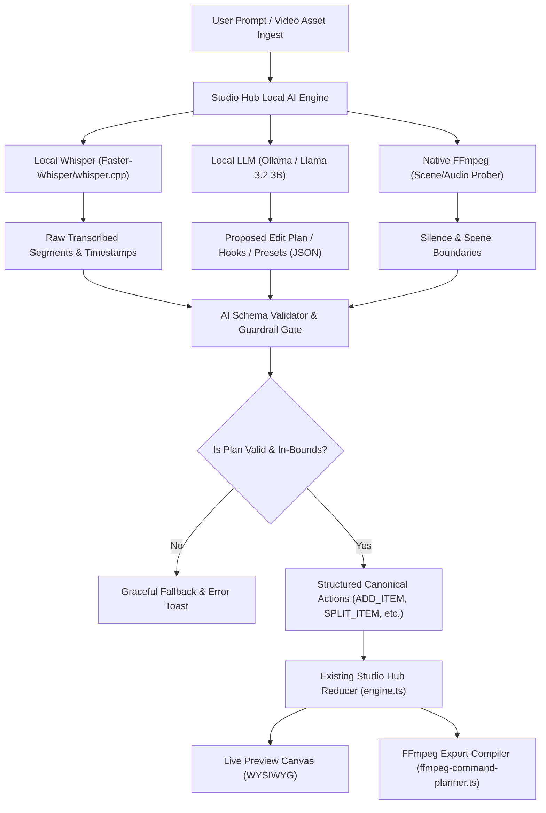

# 🧠 STUDIO HUB — FORENSIC AI INTEGRATION ARCHITECTURE REPORT
**Phase:** FORENSIC AI ARCHITECTURE & STRATEGY ANALYSIS  
**Focus Area:** STUDIO HUB (EXCLUSIVELY)  
**Execution Mode:** READ-ONLY ARCHITECTURAL EVALUATION (ZERO PRODUCTION CODE MODIFIED)  
**Date:** 2026-08-31  
**Artifact File:** `studio_hub_ai_integration_forensic_architecture.md`  

---

## 1. 🔍 SECTION A: CURRENT AI-RELEVANT ARCHITECTURE IN STUDIO HUB

Before designing any AI additions, we must map what **already exists** in the Studio Hub codebase versus what is merely an API placeholder.

```
┌──────────────────────────────────────────────────────────────────────────────────┐
│                         EXISTING STUDIO HUB AI TOUCHPOINTS                       │
│                                                                                  │
│  1. Speech Transcription Endpoint:   src/app/api/ai/transcribe/route.ts          │
│     • Currently uses: OpenAI Whisper API if OPENAI_API_KEY is present            │
│     • Fallback: Deterministic timed phrase segments in demo mode                 │
│                                                                                  │
│  2. AI Text & Hooks Generator:       src/app/api/ai/hooks/route.ts               │
│     • Currently uses: OpenAI gpt-4o-mini (via generateJson) if configured        │
│     • Fallback: Deterministic viral hook ideas dictionary                        │
│                                                                                  │
│  3. Silence Detection Engine:        src/lib/editing/audio/silence.ts            │
│     • 100% Deterministic peak-amplitude scanning (Zero API / Zero Cost)          │
│     • Generates SilenceRemovalEditPlan with split & trim cut points               │
│                                                                                  │
│  4. Canonical Action Pipeline:       src/lib/editing/canonical.ts & engine.ts    │
│     • Timeline state mutations (ADD_ITEM, TRIM_ITEM, SPLIT_ITEM, UPDATE_PROP)    │
│     • Single source of truth for preview and FFmpeg command compilation          │
│                                                                                  │
│  5. FFmpeg Command Planner:          src/lib/rendering/ffmpeg-command-planner.ts │
│     • Bundled local FFmpeg binary performs fast probing and audio extraction     │
└──────────────────────────────────────────────────────────────────────────────────┘
```

### Key Architectural Strengths to Leverage:
1. **Local FFmpeg Worker Already Present:** The project already has a functional local FFmpeg binary worker (`getFfmpegExecutablePath()`). This means video demuxing, audio extraction (16kHz mono WAV), and native audio analysis can be executed locally on the host machine at near-zero latency.
2. **Deterministic Timeline Actions:** The timeline engine is driven strictly by immutable Reducer actions (`ADD_ITEM`, `TRIM_ITEM`, `SPLIT_ITEM`, `DELETE_ITEM`, `APPLY_SILENCE_CUT_PLAN`). AI can simply emit typed, validated action payloads without needing direct DOM or store manipulation.

---

## 2. 📊 SECTION B: AI OPPORTUNITY MATRIX

We evaluate potential AI features based on **actual value to Studio Hub video production**, feasibility, and resource cost.

| Proposed AI Feature | Architectural Relevance | Complexity | Resource Cost | Classification |
| :--- | :--- | :---: | :---: | :---: |
| **Local Speech Transcription (Whisper)** | Replaces mock/cloud API with 100% local, high-accuracy subtitle and phrase generation with exact timestamps. | Low | Low (CPU/GPU) | 🟢 **HIGH VALUE** |
| **Filler Word Detection ("um", "uh", "like")** | Uses Whisper word-level timestamps to highlight or auto-split repetitive vocal hesitations. | Low | Zero extra | 🟢 **HIGH VALUE** |
| **Transcript-to-Hook & Title Generator** | Uses local LLM (Ollama) to extract viral opening hooks, captions, and title cards directly from the transcribed dialogue. | Low | Low | 🟢 **HIGH VALUE** |
| **Smart Silence / Jump-Cut Plan** | Already implemented deterministically in `silence.ts`! Enhances existing UI without needing heavy AI. | Zero (Done) | Zero | 🟢 **HIGH VALUE** |
| **Natural Language Timeline Commands ("Cut out pauses", "Make captions Neon")** | Local LLM parses user prompt into a structured, validated `CanonicalEditAction` batch. | Medium | Low | 🟢 **HIGH VALUE** |
| **Scene / Shot Cut Boundary Detection** | Deterministic FFmpeg `select='gt(scene,0.4)'` or PySceneDetect. Flags shot changes on timeline. | Low | Low | 🟡 **MEDIUM VALUE** |
| **AI Social Description & Hashtags Generator** | Generates platform-specific copy (TikTok, Reels, Shorts) from the transcript. | Low | Low | 🟡 **MEDIUM VALUE** |
| **Smart Auto-Reframe (16:9 $\to$ 9:16 Subject Tracking)** | Crops widescreen video to vertical reel keeping speaker centered using lightweight face/pose bounding box. | High | Medium | 🟡 **MEDIUM VALUE** |
| **AI B-Roll / Stock Asset Suggestions** | Analyzes transcript themes to recommend relevant stickers, graphics, or user assets. | Medium | Low | 🟡 **MEDIUM VALUE** |
| **Full Generative Video Synthesis (Text-to-Video)** | Generative models (e.g. SVD, CogVideo) require 16GB+ VRAM, minutes per frame, and are outside the scope of an editor. | Extreme | Extreme | 🔴 **LOW VALUE / OVERENGINEERING** |
| **Neural Voice Cloning / TTS Synthesis** | Requires heavy models, storage, and audio alignment; unnecessary for raw footage editing. | High | High | 🔴 **LOW VALUE / OVERENGINEERING** |
| **Real-Time Per-Frame Computer Vision Segmentation** | Running heavy neural segmentation in preview canvas creates browser stutter and memory leaks. | High | High | 🔴 **LOW VALUE / OVERENGINEERING** |

---

## 3. 🛠️ SECTION C: FREE / LOCAL AI TECHNOLOGY MATRIX

Here is an honest evaluation of free, open-source, local AI technologies compatible with the Windows / Node.js / Next.js environment:

| Technology | Purpose in Studio Hub | Free / Local? | Account / API Key? | Hardware Req | Integration Complexity | Verdict |
| :--- | :--- | :---: | :---: | :---: | :---: | :---: |
| **Faster-Whisper / whisper.cpp** | Local speech-to-text with word-level timestamps | ✅ 100% Free & Local | ❌ No Account / No Key | Runs on CPU (AVX2) or CUDA GPU (8x real-time) | **Low** (Simple CLI spawn or local Python worker) | 🟢 **STRONGLY RECOMMENDED** |
| **Ollama (or llama.cpp server)** | Local LLM for structured JSON (Hooks, Titles, Natural Language commands) | ✅ 100% Free & Local | ❌ No Account / No Key | Runs comfortably on CPU or GPU with 3B–8B models (e.g. Llama 3.2 3B, Qwen 2.5 7B) | **Low** (Standard OpenAI-compatible REST endpoint at `http://localhost:11434/v1`) | 🟢 **STRONGLY RECOMMENDED** |
| **Native FFmpeg Filters (`silencedetect`, `scene`, `ebur128`)** | Silence detection, shot change detection, loudness measurement | ✅ 100% Free & Local | ❌ No Account / No Key | Zero extra runtime (already bundled binary) | **Zero / Low** | 🟢 **STRONGLY RECOMMENDED** |
| **Transformers.js (In-Browser ONNX)** | WebAssembly in-browser Whisper / sentiment | ✅ 100% Free & Local | ❌ No Account / No Key | Relies on client WebGPU/Wasm (can freeze browser on long clips) | Medium | 🟡 **OPTIONAL CLIENT FALLBACK** |
| **PySceneDetect / OpenCV** | Advanced visual shot transition detection | ✅ 100% Free & Local | ❌ No Account / No Key | CPU / GPU | Medium (Python runtime dependency) | 🟡 **SECONDARY PHASE** |
| **Cloud OpenAI / Deepgram API** | Cloud fallback when local compute is unavailable | ⚠️ Paid usage | ⚠️ API Key required | Zero local compute | Very Low (already partially written) | ⚪ **OPTIONAL FALLBACK ONLY** |

---

## 4. 📐 SECTION D: RECOMMENDED AI ARCHITECTURE

### The Safety Rule: Decoupled AI Proposal $\to$ Validated Action $\to$ Timeline
AI models can hallucinate, produce malformed structures, or suggest invalid timestamps. **AI must never have direct write access to the React state or timeline store.**



### Centralized Provider Interface:
A single unified provider abstraction allows Studio Hub to seamlessly switch between **Local Zero-Account Providers (Default)** and **Optional Cloud APIs** without changing a single line of UI or timeline code:

```typescript
// Unified Local/Cloud AI Provider Interface
export interface StudioAiProvider {
  id: 'local_ollama' | 'local_whisper' | 'ffmpeg_native' | 'cloud_openai';
  isAvailable(): Promise<boolean>;
  transcribe(audioBuffer: Buffer, language?: string): Promise<TranscriptionResult>;
  generateStructured<T>(prompt: string, schema: any): Promise<T>;
}
```

---

## 5. 🚦 SECTION E: PRIORITIZED IMPLEMENTATION ROADMAP

```text
PHASE 1: AI FOUNDATION & LOCAL WHISPER ENGINE
├── Goal: 100% Free, Local, Offline Speech Transcription with word timestamps.
├── Tech: Local Whisper engine (whisper.cpp or faster-whisper) + FFmpeg 16kHz audio extraction.
├── Accounts Required: ❌ ZERO.
├── User Value: Immediate offline transcription, automatic Hormozi captions without API fees.
└── Risk: Very Low.

PHASE 2: LOCAL LLM HOOK & METADATA INTELLIGENCE (OLLAMA)
├── Goal: Transcript-to-Hook generation, dynamic title overlays, and caption restyling suggestions.
├── Tech: Local Ollama / llama.cpp provider (Llama 3.2 3B / Qwen 2.5 7B) via OpenAI-compatible endpoint.
├── Accounts Required: ❌ ZERO.
├── User Value: 1-click viral hook creation on timeline text track.
└── Risk: Low.

PHASE 3: SMART EDITING ASSISTANT & TIMELINE INTENT PARSER
├── Goal: Natural language timeline edits (e.g. "Cut silence and highlight key points").
├── Tech: Structured JSON parser mapping prompts $\to$ canonical `EditState` action payloads.
├── Accounts Required: ❌ ZERO.
├── User Value: High-leverage editing commands.
└── Risk: Low (safeguarded by schema validation).

PHASE 4: NATIVE VISUAL INTELLIGENCE (FFMPEG SCENE DETECTION)
├── Goal: Automatic shot/scene split markers on timeline.
├── Tech: Native FFmpeg scene score filter.
├── Accounts Required: ❌ ZERO.
├── User Value: Effortless multi-shot video splitting.
└── Risk: Very Low.
```

---

## 6. 💳 SECTION F: ACCOUNT & DEPENDENCY REQUIREMENTS

| Technology | Account Required? | API Key Required? | Free? | Local? | Recommended for Studio Hub? |
| :--- | :---: | :---: | :---: | :---: | :---: |
| **whisper.cpp / Faster-Whisper** | ❌ **NO** | ❌ **NO** | ✅ **YES** | ✅ **YES** | 🟢 **STRONGLY RECOMMENDED** |
| **Ollama / llama.cpp** | ❌ **NO** | ❌ **NO** | ✅ **YES** | ✅ **YES** | 🟢 **STRONGLY RECOMMENDED** |
| **FFmpeg Native Filters** | ❌ **NO** | ❌ **NO** | ✅ **YES** | ✅ **YES** | 🟢 **STRONGLY RECOMMENDED** |
| **Supabase Database** | ❌ **NO (for Studio Hub)** | ❌ **NO** | ✅ **YES** | ⚠️ Browser Local | 🟢 Local storage / IndexedDB is 100% sufficient |
| **OpenAI / Azure OpenAI** | ⚠️ Optional | ⚠️ Optional | ❌ Paid | ❌ Cloud | ⚪ Optional cloud fallback only |
| **Deepgram / AssemblyAI** | ⚠️ Optional | ⚠️ Optional | ❌ Paid | ❌ Cloud | ⚪ Unnecessary (Local Whisper is equal or better) |

---

## 7. 🎯 EXECUTIVE SUMMARY & STRATEGIC RECOMMENDATIONS

### 1. TOP 5 AI FEATURES WE SHOULD ACTUALLY BUILD
1. **Local Whisper Speech Transcription Engine:** 100% free, offline, exact word timestamps powering auto-captions and transcript editing.
2. **Filler Word Hesitation Highlighting & Auto-Cut:** Highlights "um", "uh", "you know" from Whisper timestamps with 1-click removal.
3. **Transcript-to-Viral-Hook Overlay Generator:** Local LLM reads transcribed text and generates calibrated title cards and lower thirds directly on `track-text-1`.
4. **Natural Language Timeline Intent Parser:** Allows users to type natural commands ("remove silences longer than 0.5s", "apply Neon preset to all captions") safely validated against canonical reducer actions.
5. **Native FFmpeg Scene & Cut Detection:** Fast, zero-model shot boundary detection marking transition points on the timeline.

### 2. TOP 5 AI IDEAS WE SHOULD NOT BUILD YET
1. ❌ **Generative Text-to-Video Diffusion Models:** Enormous VRAM footprint, slow, completely unsuited for an editing studio.
2. ❌ **Neural Voice Cloning / Audio Inpainting:** Unnecessary complexity when users edit raw footage.
3. ❌ **In-Browser Real-Time Frame Segmentation:** Causes frame drops and UI lag during preview scrub.
4. ❌ **Cloud-Only AI APIs as Hard Dependencies:** Avoid creating monthly subscription fees or vendor lock-in.
5. ❌ **Autonomous Direct Timeline Mutation:** AI must never bypass canonical action validation.

### 3. REQUIRED ACCOUNTS
* **ZERO (0) ACCOUNTS REQUIRED.**
* No OpenAI, no Azure, no Deepgram, no Cloudinary, and no mandatory cloud database needed for Studio Hub.

### 4. OPTIONAL ACCOUNTS
* **OpenAI / Deepgram:** Optional cloud API keys if a user running on very low-end hardware prefers cloud offloading.

### 5. ZERO-ACCOUNT LOCAL AI STACK RECOMMENDATION
$$\boxed{\text{Local FFmpeg (Audio extraction \& Scene Detection)} + \text{Local Whisper (STT)} + \text{Local Ollama (JSON LLM)} + \text{IndexedDB Storage}}$$

### 6. SINGLE STRONGEST ARCHITECTURAL RECOMMENDATION
> **"Every AI feature must be a pure, side-effect-free function that accepts project data and emits validated Canonical Edit Actions into the existing Reducer. Never let AI touch the timeline directly."**

---

```text
FORENSIC AI ARCHITECTURE REPORT COMPLETE — ZERO PRODUCTION CODE MODIFIED
```
