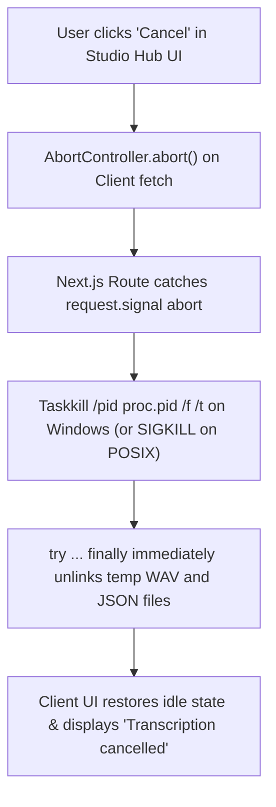

# 🎙️ STUDIO HUB — PHASE 19C: REAL-WORLD CERTIFICATION, PROGRESS UX & RELIABILITY BLUEPRINT
**Phase:** PHASE 19C — REAL-WORLD SPEECH AI HARDENING & UX EXCELLENCE  
**Sub-Phases:** 19C-A (Diagnostics & Setup Gate), 19C-B (Dynamic Timeout, Progress UX & Abort Cancellation), 19C-C (Multilingual Hindi/Hinglish Benchmark)  
**Execution Mode:** COMPREHENSIVE ARCHITECTURAL BLUEPRINT  
**Date:** 2026-08-31  
**Artifact File:** `studio_hub_phase_19c_real_world_certification_and_ux_plan.md`  

---

## 1. 🔍 THE REALITY GAP: FROM CODE-COMPLETE TO PRODUCTION-CERTIFIED

Automated unit tests and mocked Playwright assertions prove that the code compiles and the data structures align. However, **real-world production readiness requires solving four critical operational challenges**:

```
┌────────────────────────────────────────────────────────────────────────────────────────┐
│                          REAL-WORLD OPERATIONAL CHALLENGES                             │
│                                                                                        │
│  1. Silent Fake Captions Trap:                                                         │
│     • Problem: Silently generating mock demo captions when local Whisper is absent    │
│       misleads users into believing real AI processed their media.                     │
│     • Resolution: Honest diagnostic status banner & direct setup guidance.             │
│                                                                                        │
│  2. Rigid 90s Timeout on Long Videos:                                                  │
│     • Problem: A 10-minute video on a 2-core laptop CPU will take >90s and be killed.   │
│     • Resolution: Duration-aware dynamic timeout formula with safety ceiling.          │
│                                                                                        │
│  3. Black-Box Spinner / No Cancellation:                                               │
│     • Problem: Long transcriptions freeze UI without stage feedback or Cancel button.  │
│     • Resolution: Multi-stage progress state machine + AbortController process kill.   │
│                                                                                        │
│  4. Multilingual & Hinglish Acoustic Precision:                                        │
│     • Problem: Creator content in India uses mixed Hindi-English (Hinglish).           │
│     • Resolution: Language selection controls (Auto, Hindi, English) & prompt tuning.  │
└────────────────────────────────────────────────────────────────────────────────────────┘
```

---

## 2. 🏛️ PHASE 19C-A: HONEST DIAGNOSTICS & SETUP DISCOVERY

### Architectural Rule: No Hidden Fake Results in Production
When a user clicks "Auto Generate Captions":
* If `whisper-cli.exe` and `ggml-base.bin` are **present** $\implies$ Run 100% real local offline transcription.
* If **missing** $\implies$ Show an honest, actionable diagnostic card in the Captions panel:

```text
┌──────────────────────────────────────────────────────────────┐
│  🎙️ Local AI Speech Engine: Setup Required                   │
│                                                              │
│  Studio Hub runs Whisper locally for 100% free, private,     │
│  offline subtitle generation with zero API costs.            │
│                                                              │
│  Status:                                                     │
│    ✓ FFmpeg Prober: Installed                                │
│    ✗ Whisper Binary: Missing in bin/whisper/whisper-cli.exe  │
│    ✗ Whisper Model: Missing in models/whisper/ggml-base.bin  │
│                                                              │
│  [ Quick Setup Guide ]           [ Check Installation ]      │
└──────────────────────────────────────────────────────────────┘
```

### New Diagnostics Endpoint:
`GET /api/ai/transcribe/status` returns:
```typescript
export interface WhisperInstallationStatus {
  isReady: boolean;
  ffmpeg: { available: boolean; path: string | null };
  binary: { available: boolean; path: string | null; name: string | null };
  model: { available: boolean; path: string | null; name: string | null };
}
```

---

## 3. ⏱️ PHASE 19C-B: DYNAMIC TIMEOUT, MULTI-STAGE PROGRESS & CANCELLATION

### 1. Duration-Aware Dynamic Timeout Formula:
Instead of a static 90s timeout, the timeout scales dynamically with video length and hardware capability:

$$\text{Timeout (ms)} = \max\Big(90\,000,\; \min\big(900\,000,\; 60\,000 + (\text{durationSeconds} \times 3\,000)\big)\Big)$$

* **30-second Reel:** $90\text{ seconds}$
* **3-minute Video:** $60 + (180 \times 3) = 600\text{ seconds}$ ($10\text{ minutes}$)
* **10-minute Video:** $900\text{ seconds}$ ($15\text{ minutes maximum safety ceiling}$)

---

### 2. Multi-Stage Progress State Machine:
The UI provides live stage tracking across the 4 physical phases of local speech processing:

```text
Stage 1: Preparing media buffer & workspace           (0% – 15%)
Stage 2: Extracting 16kHz mono PCM WAV via FFmpeg     (15% – 30%)
Stage 3: Running local AI speech recognition (Whisper) (30% – 85%)
Stage 4: Synchronizing timed caption layers           (85% – 100%)
```

---

### 3. AbortController Cancellation Pipeline:
If the user clicks `[ Cancel ]` while a 10-minute transcription is running:



---

## 4. 🇮🇳 PHASE 19C-C: MULTILINGUAL & HINDI/HINGLISH BENCHMARK

Studio Hub will provide an explicit language override selector in the Captions panel:
* **Auto-Detect (Multilingual Default):** Passed as `-l auto`
* **Hindi (हिन्दी):** Passed as `-l hi` (Forces Devanagari script output)
* **English:** Passed as `-l en` (Forces Latin script output)

### Benchmark Protocol:
1. **English Creator Reel:** Rapid American/British/Indian accent English.
2. **Pure Hindi Speech:** Devanagari script consistency and conjunction accuracy.
3. **Hinglish Dialogue:** Code-switching between Hindi verbs and English technical terminology.
4. **Noisy Background:** Audio with BGM track to verify speech isolation.

---

## 5. 📂 FILES TO BE ENHANCED IN PHASE 19C

1. [`src/lib/ai/local-whisper-worker.ts`](file:///c:/Users/Pratik/Desktop/New%20folder%20%284%29/KontentOS/src/lib/ai/local-whisper-worker.ts):
   - Add `getWhisperInstallationStatus()`.
   - Add `calculateWhisperTimeoutMs(durationSeconds)`.
   - Add `signal?: AbortSignal` support to abort and kill child processes immediately.
2. [`src/app/api/ai/transcribe/route.ts`](file:///c:/Users/Pratik/Desktop/New%20folder%20%284%29/KontentOS/src/app/api/ai/transcribe/route.ts):
   - Add `GET` handler returning installation diagnostic status.
   - Listen to `request.signal.addEventListener('abort', ...)` and forward to worker.
3. [`src/components/tabs/raw-studio/RawStudioInspector.tsx`](file:///c:/Users/Pratik/Desktop/New%20folder%20%284%29/KontentOS/src/components/tabs/raw-studio/RawStudioInspector.tsx):
   - Add Language dropdown (`Auto`, `Hindi`, `English`).
   - Add Diagnostic Banner when local Whisper binary/model is missing with "Check Installation" trigger.
   - Add multi-stage progress indicator with Cancel button during transcription.

---

## 6. 🏁 IMPLEMENTATION ROADMAP FOR PHASE 19C

```text
STEP 1: Implement Dynamic Timeout & Abort Cancellation in local-whisper-worker.ts
STEP 2: Add GET /api/ai/transcribe/status diagnostic route
STEP 3: Add Language Selector & Honest Diagnostic Banner in RawStudioInspector.tsx
STEP 4: Add Multi-Stage Progress UX with [Cancel] button
STEP 5: Full verification gates (TypeScript, Playwright, Regressions)
```

```text
BLUEPRINT COMPLETE — READY FOR EXECUTION
```
